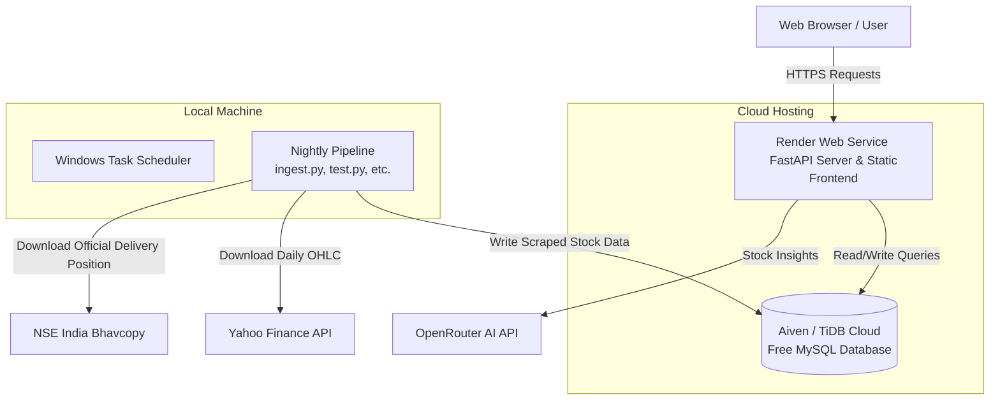

# Free Deployment Guide: Stock Market Project

This guide provides a step-by-step plan to deploy the Stock Market Project **completely for free** using a modern, robust hybrid architecture.

---

## 🏗️ Architecture Overview

To run this application successfully and keep it **100% free**, we use a hybrid deployment model:



### Why a Hybrid Architecture?
1. **NSE India Cloud Blocks:** NSE India actively blocks requests originating from known cloud providers (AWS, Azure, Render, GitHub Actions). Running `nse_delivery_fetcher.py` in the cloud will fail with a `403 Forbidden` error. By running the daily data scraper locally, it uses your home/office residential IP, which bypasses NSE filters.
2. **Resource Constraints:** Heavy data aggregation and technical indicator calculations (using Pandas/yfinance) consume memory and CPU. Running them locally saves your free Render tier's limited compute resource quota.
3. **Seamless Sync:** Since the local scripts connect directly to your cloud database, any data updated locally is instantly reflected on the live site!

---

## 🗄️ Step 1: Set Up Your Free MySQL Database

Render's free tier database is PostgreSQL (and expires after 90 days). Since this application relies on MySQL, we will use a dedicated free MySQL hosting provider.

### Option A: Aiven MySQL (Recommended)
* **What you get:** 1 Free MySQL Instance, 5GB Storage, 1GB RAM. No credit card required.
1. Sign up for a free account at [aiven.io](https://aiven.io/).
2. Create a new service and select **MySQL**.
3. Choose **Free Tier** and select a cloud provider region closest to you (e.g. AWS `ap-south-1` Mumbai or similar).
4. Once the service is running, navigate to the dashboard to copy your connection parameters:
   * **Host / Service URI**
   * **Port** (usually `3306` or a custom high port like `24856`)
   * **User** (usually `avnadmin`)
   * **Password**
   * **Database Name** (usually `defaultdb`)

### Option B: TiDB Cloud Serverless (MySQL-Compatible)
* **What you get:** 1 Free Serverless Cluster, 5GB Storage.
1. Go to [pingcap.com/products/tidb-free](https://www.pingcap.com/products/tidb-free) and register.
2. Spin up a **Serverless (Free Tier)** cluster.
3. Click **Connect** on the dashboard, select **General** / **mysql-client**, and copy your connection string variables.

---

## 🧬 Step 2: Initialize Database Tables

Before running the application, we must create the necessary tables in your new cloud database.

1. Create or modify your local `.env` file in the project folder to point to your new cloud database connection parameters:
   ```env
   DB_HOST=your-cloud-db-host
   DB_USER=avnadmin
   DB_PASSWORD=your-cloud-db-password
   DB_NAME=defaultdb
   DB_PORT=your-cloud-db-port
   
   # JWT & AI API Configuration
   JWT_SECRET_KEY=generate-a-secure-random-string-here
   OPENROUTER_API_KEY=your-openrouter-key-if-any
   ```

2. Run the table creation scripts from your command line:
   ```powershell
   # 1. Create the base users table
   python create_users_table.py

   # 2. Create the saved scans query table
   python create_saved_scans_table.py

   # 3. Create the dashboard signals & widgets registry
   python create_widget_tables.py

   # 4. Create the main historical_data table (contains all signals)
   python create_historical_data_table.py
   ```

3. Perform your initial data backfill to populate the database:
   ```powershell
   # Downloads initial daily OHLC prices into ohlc_data
   python ingest.py

   # Generates technical signals and builds historical_data
   python test.py

   # Fetches and overlays delivery data
   python nse_delivery_fetcher.py 40
   python run_delivery_signal.py
   ```
   > [!NOTE]
   > The initial backfill might take a few minutes as it pulls historical data for the Nifty 500 universe.

---

## 🌐 Step 3: Deploy the FastAPI Web App to Render

We will deploy both the FastAPI backend and the static HTML/CSS/JS frontend as a single Web Service on Render.

### 1. Push Your Code to GitHub
Ensure all your project code is committed and pushed to a GitHub repository.
> [!IMPORTANT]
> Make sure your `.env` file and `node_modules` are in your `.gitignore` so you do not expose private database credentials on GitHub.

### 2. Configure the Web Service on Render
1. Log in to [render.com](https://render.com/) and click **New +** -> **Web Service**.
2. Connect your GitHub account and select your repository.
3. Use the following configuration settings:
   * **Name:** `stock-market-scanner`
   * **Region:** Choose a region close to your database (e.g., `Singapore` or `Frankfurt`)
   * **Branch:** `main`
   * **Language:** `Python`
   * **Build Command:** `pip install -r requirements.txt`
   * **Start Command:** `uvicorn app:app --host 0.0.0.0 --port $PORT`
   * **Instance Type:** `Free`

### 3. Add Environment Variables
Scroll down to the **Environment Variables** section on Render and add:
* `DB_HOST` = (Your cloud database host)
* `DB_USER` = (Your cloud database username)
* `DB_PASSWORD` = (Your cloud database password)
* `DB_NAME` = (Your cloud database name)
* `DB_PORT` = (Your cloud database port, e.g. `24856`)
* `JWT_SECRET_KEY` = (A secure random secret string)
* `OPENROUTER_API_KEY` = (Optional: Your OpenRouter API key)

Click **Create Web Service**. Render will deploy the application and give you a public URL (e.g., `https://stock-market-scanner.onrender.com`).

---

## ⏰ Step 4: Schedule Daily Automated Ingestion

Since the stock market data updates daily, we must run our pipeline every trading day after market close. By scheduling this locally, we avoid cloud-based IP bans from NSE India.

### 1. Create your local Environment File
Ensure your local `c:\Users\Varshil\Google Drive\It-Vedant\Stock_Market_Project\.env` file matches your cloud database parameters. Now, running `run_nightly.bat` locally will automatically push the fresh data directly to your Render app!

### 2. Automate Local Pipeline via Windows Task Scheduler
You can set up Windows to run `run_nightly.bat` automatically every Monday through Friday evening:
1. Open the Windows **Start Menu**, search for **Task Scheduler**, and open it.
2. Click **Create Basic Task** in the right-hand panel.
3. Configure the wizard:
   * **Name:** `Stock Market Ingestion Pipeline`
   * **Trigger:** `Weekly`
   * **Days:** Check `Monday`, `Tuesday`, `Wednesday`, `Thursday`, `Friday`
   * **Start Time:** Set it to `19:00:00` (7:00 PM IST — this ensures NSE has published daily delivery reports)
   * **Action:** `Start a program`
   * **Program/script:** Click Browse and select your `run_nightly.bat` file:
     `c:\Users\Varshil\Google Drive\It-Vedant\Stock_Market_Project\run_nightly.bat`
   * **Start in (optional):** Enter the folder path:
     `c:\Users\Varshil\Google Drive\It-Vedant\Stock_Market_Project`
4. Click **Finish**.
5. **Additional Setting (Highly Recommended):** 
   * Double-click the newly created task in the Task Scheduler Library.
   * Go to the **Conditions** tab.
   * Uncheck `Start the task only if the computer is on AC power` (especially if you are on a laptop).
   * Under the **Settings** tab, check `Run task as soon as possible after a scheduled start is missed` (so if your PC was asleep at 7 PM, it runs immediately when you wake it up).

---

## 🛠️ Maintenance & Troubleshooting

### Render Spin-up Delay
On Render's free tier, the web server goes to sleep after 15 minutes of inactivity. When you visit the website URL after it has gone to sleep, it will take about **50 seconds** to spin back up and display the login page. This is normal for free hosting.

### Local Database Connections
If you want to debug or test locally without touching the live cloud database, you can keep a copy of your `.env` named `.env.local` configured with local credentials (`localhost`, `root`, etc.), and rename it to `.env` whenever you want to test locally.
